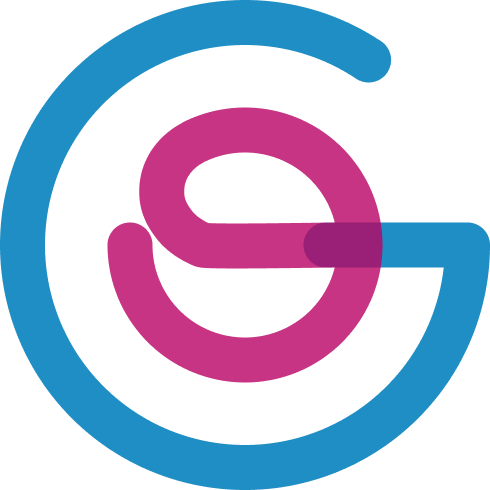

[](https://GitHub.com/Naereen/StrapDown.js/graphs/commit-activity)
[](https://shields.io/)



#### Plataforma Global ORG
A Plataforma Global ORG foi desenvolvida através do [Create React App](https://github.com/facebook/create-react-app).

<br>

#### Para baixar, instalar, iniciar

```
git clone https://github.com/GrupoCPB/globalorg-web-frontend.git && cd global.org3 && npm install && npm start
```

*Após essa linha de comando, acesse esse endereço [http://localhost:3000](http://localhost:3000) para visualizar a interface gráfica em seu navegador.* 

<br>

#### Como baixar, instalar, iniciar


<br>
<br>

### Dependências do sistema
```markdown
NodeJs **v12^**
Yarn **V12^***
Npm **v10^**
React **^17.0.1**
Web Vitals **^1.0.1**
Styled Components **^5.2.1**
React Scripts **4.0.2**
React Dom **^17.0.1**
React Router Dom **^5.2.0**
User Event **^12.1.10**
Jest Dom **^5.11.4**
FontAwesome **^5.15.2**
PostgreSQL
```

<br>
<br>

#### Estrutura de arquivos, pastas no projeto
```markdown
├── public
  ├── components
  |   ├── arquivo.js
  |   └── etc.js
├── src
  |   ├── components
  |   │   ├── First_Section
  |   |   |  ├── imagens
  |   |   |  |  ├── Friends.png
  |   |   |  |  ├── Searching.png
  |   |   |  |  ├── Service.png
  |   |   |  |  ├── Writing.png
  |   |   |  |  ├── banner_image.png
  |   |   |  ├── index.js
  |   |   |  ├── Images.js
  |   │   ├── Menu
  |   |   |  ├── index.js
  |   │   ├── Menu_item
  |   |   |  ├── index.js
  |   │   ├── Footer
  |   |   |  ├── index.js
  |   │   ├── Logo
  |   |   |  ├── index.js
  |   |   |  ├── img
  |   |   |  |  ├── global-logo.png
  |   |   |  |  ├── global-logo.jng
  |   │   ├── Search
  |   |   |  ├── index.js
  |   │   ├── Social_Media
  |   |   |  ├── index.js
  |   |   |  ├── img
  |   |   |  |  ├── FB.png
  |   |   |  |  ├── IG.jng
  |   |   |  |  ├── LinkedIn.png
  |   |   |  |  ├── Twitter.jng
  |   |   |  |  ├── WPP.jng
  |   |   |  |  ├── YouTube.jng
  |   │   ├── PageDefault
  |   |   |  ├── index.js
  |   │   ├── Header
  |   |   |  ├── index.js
  |   ├── pages
  |   │   ├── Cadastro
  |   |   |  ├── ONG
  |   |   |  |  ├── index.js  
  |   |   |  ├── Vaga
  |   |   |  |  ├── index.js
  |   |   |  ├── ONG
  |   |   |  |  ├── index.js  
  |   |   |  ├── Voluntario
  |   |   |  |  ├── index.js
  |   |   ├── Pagina404
  |   |   |  |  ├── Pagina404.js
  |   │   ├── Home
  |   |   |  ├── index.js
  |   │   ├── Login
  |   |   |  ├── ONG
  |   |   |  |  ├── index.js  
  |   |   |  ├── Voluntario
  |   |   |  |  ├── index.js
  |   │   ├── Perfil
  |   |   |  ├── ONG
  |   |   |  |  ├── index.js  
  |   |   |  ├── Voluntario
  |   |   |  |  ├── index.js
```

<br>
<br>

#### Recursos e Diferenciais
*Dizer quais são os recursos da Plataforma*

<br>
<br>
<br>

#### Dúvidas?
- Acesse nosso Changelog.md
- Acesse nosso Contributing.md
- Acesse nosso CodeOfCoduct.md

<br>
<br>
